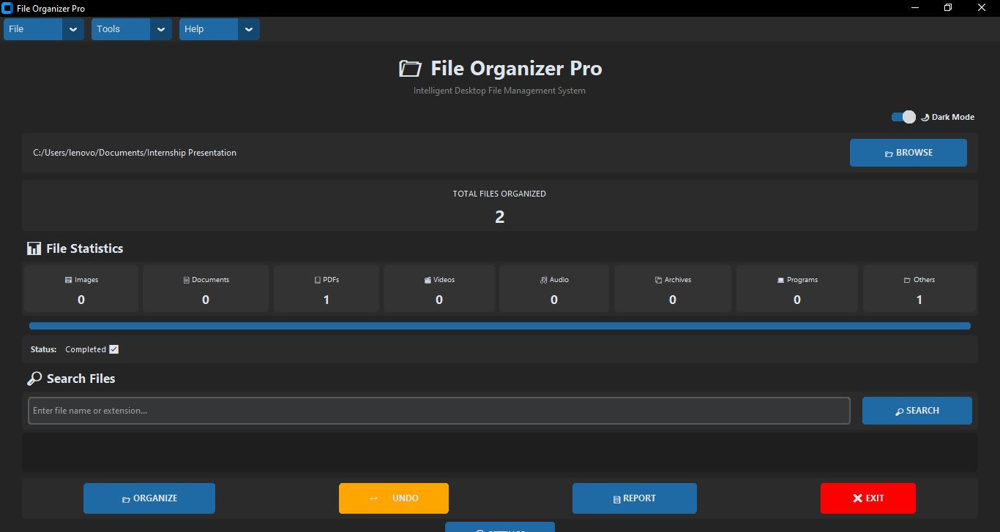
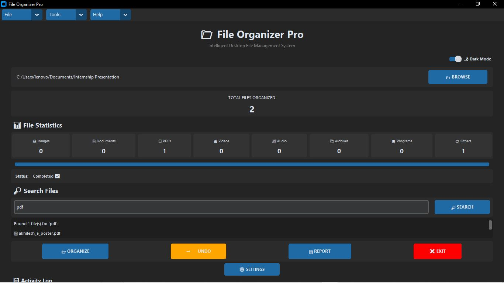
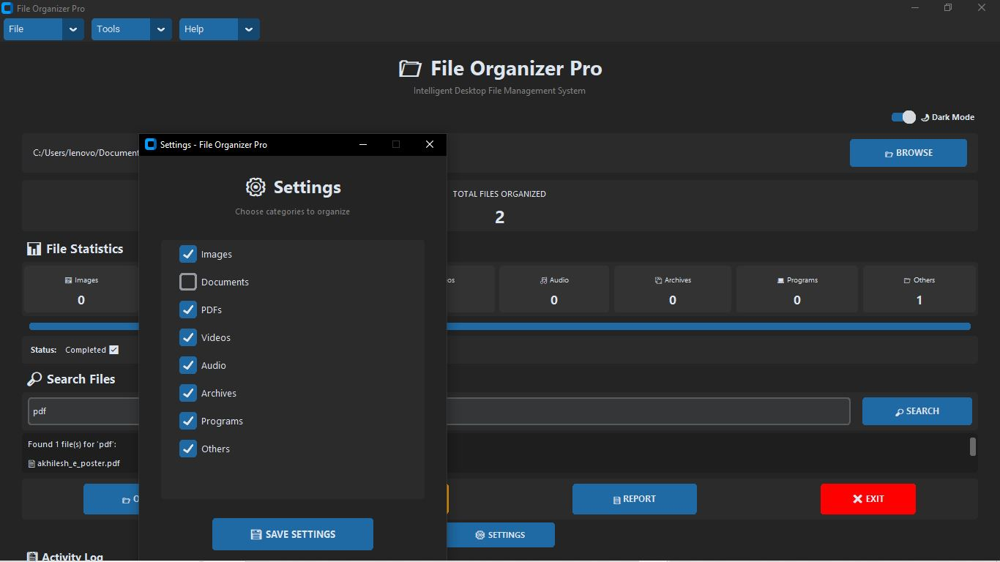
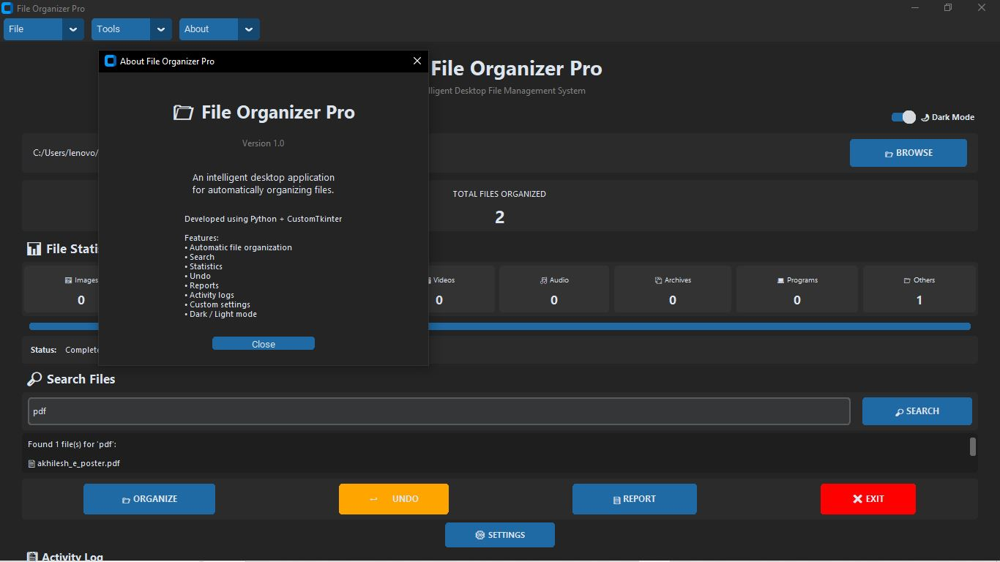

# 📁 File Organizer Pro

A professional desktop file management application developed using **Python** and **CustomTkinter**.

File Organizer Pro automatically organizes files into categorized folders based on their file extensions. It provides a simple and user-friendly interface along with useful features such as search, undo, reports, activity logs, settings, and dark/light mode.

---

## 🚀 Features

- 📂 Browse and select folders
- 📁 Automatically organize files
- 🖼️ Categorize images
- 📄 Organize documents
- 📑 Organize PDF files
- 🎬 Organize videos
- 🎵 Organize audio files
- 📦 Organize archives
- 💻 Organize program files
- 📊 File organization statistics
- 📈 Progress bar
- 📋 Activity logs
- ↩️ Undo last organization
- 🔎 Search files
- 📄 Generate organization reports
- ⚙️ Custom category settings
- 🌙 Dark mode
- ☀️ Light mode
- 🗂️ File / Tools / Help menus
- ℹ️ About window
- 🖥️ Windows executable support

## 🖥️ Application Preview

### 🏠 Main Dashboard



### 🔎 File Search



### ⚙️ Settings



### ℹ️ About



---

## 🛠️ Technologies Used

- Python
- CustomTkinter
- pathlib
- os
- shutil
- logging
- PyInstaller

---

## 📂 Project Structure

```text
FileOrganizerPro/
│
├── main.py
├── gui.py
├── organizer.py
├── file_types.py
├── undo.py
├── search.py
├── report.py
├── settings.py
├── logger.py
│
├── screenshots/
│   ├── main-dashboard.png
│   ├── search.png
│   ├── settings.png
│   └── about.png
│
├── reports/
├── logs/
├── assets/
│
├── requirements.txt
├── README.md
└── .gitignore